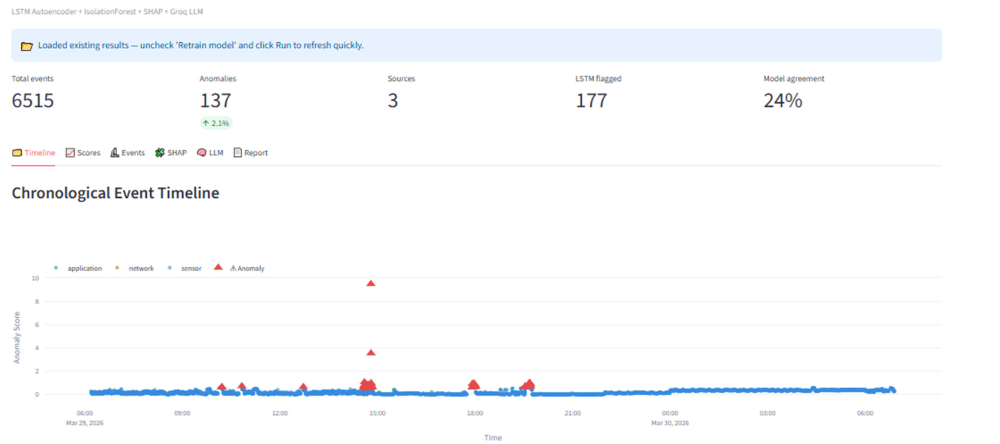
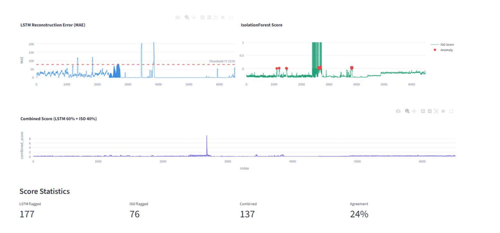
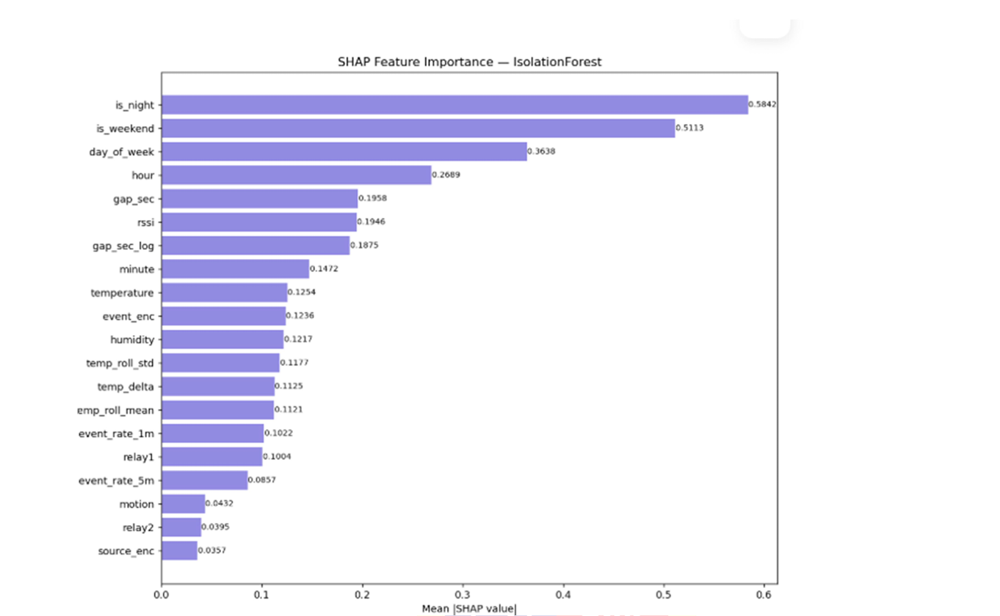

# 🔍 IoT Forensic Log Analyzer & Timeline Reconstructor Tool

<p align="center">


</p>

---

# 📖 Overview

The **IoT Forensic Log Analyzer & Timeline Reconstructor Tool** is an AI-powered digital forensic investigation system developed to assist investigators in analyzing security incidents within smart home and small-scale IoT environments.

Modern IoT devices continuously generate evidence across multiple sources including sensor logs, application logs, and network traffic. Investigating these incidents manually is difficult because the evidence is fragmented and stored in different formats.

This project automatically collects, correlates, and analyzes evidence from multiple forensic sources to reconstruct a unified investigation timeline. A hybrid machine learning model detects anomalous activities, SHAP provides explainable AI insights, and a Large Language Model generates human-readable forensic investigation reports.

The complete system was developed and evaluated using a real ESP8266-based IoT environment.

---

# ✨ Key Features

- 🔹 Multi-source forensic evidence collection
- 🔹 JSON, TXT and PCAP log analysis
- 🔹 Timeline reconstruction
- 🔹 Hybrid anomaly detection
  - LSTM Autoencoder
  - Isolation Forest
- 🔹 Explainable AI using SHAP
- 🔹 LLM-generated forensic reports
- 🔹 Interactive Streamlit dashboard
- 🔹 Cross-layer evidence correlation
- 🔹 Consumer hardware deployment

---

# 🏗️ System Architecture

> *(Insert your architecture diagram here)*

<p align="center">

</p>

---

# 🔄 Investigation Workflow

```
IoT Sensors
      │
      ▼
 MQTT Broker
      │
 ┌────┴─────┐
 │          │
Node-RED  Wireshark
 │          │
 └────┬─────┘
      ▼
 Log Collection
      ▼
 Data Parsing
      ▼
 Feature Engineering
      ▼
 LSTM Autoencoder
      │
 Isolation Forest
      ▼
 Hybrid Scoring
      ▼
 SHAP Explainability
      ▼
 Timeline Reconstruction
      ▼
 LLM Investigation Report
      ▼
 Streamlit Dashboard
```

---

# 🧠 AI Detection Pipeline

The anomaly detection engine combines two complementary machine learning models.

### LSTM Autoencoder

- Learns normal sequential behaviour
- Detects temporal anomalies
- Uses reconstruction error for anomaly scoring

### Isolation Forest

- Detects statistical outliers
- Independent of sequence information
- Efficient on unlabeled datasets

The final anomaly score is calculated using a weighted hybrid approach.

```
Combined Score =
0.6 × LSTM Score
+
0.4 × Isolation Forest Score
```

SHAP Explainability is then applied to determine which features contributed most toward each anomaly.

---

# 📊 Experimental Results

| Metric | Value |
|---------|------:|
| Events Analysed | 6515 |
| Detected Anomalies | 137 |
| Detection Rate | 2.1% |
| LSTM Alerts | 177 |
| Isolation Forest Alerts | 76 |
| Model Agreement | 24% |

### Key Finding

The hybrid model successfully detected anomalous behaviour generated during a simulated IoT DoS attack. SHAP analysis revealed that temporal behavioural features such as **hour**, **day of week**, and **night activity** contributed more significantly to anomaly detection than raw sensor values.

---

# 🖥 Dashboard

The Streamlit dashboard provides an interactive forensic investigation environment.

### Dashboard



---

### Detection Scores



---

### SHAP Explainability



---

### LLM Investigation Report


---

# 🛠 Technology Stack

### Programming

- Python

### Machine Learning

- TensorFlow
- Keras
- Scikit-learn
- Isolation Forest
- SHAP

### Data Processing

- Pandas
- NumPy
- Scapy

### Dashboard

- Streamlit
- Plotly

### Networking

- Wireshark
- Mosquitto MQTT
- Node-RED

### Hardware

- ESP8266 NodeMCU
- DHT11
- PIR Motion Sensor
- Relay Module

### AI

- Groq API
- Llama 3.3 70B

---

# 🎯 Project Highlights

✔ Hybrid anomaly detection

✔ Explainable AI

✔ Timeline reconstruction

✔ Cross-layer evidence correlation

✔ Automated forensic reporting

✔ Interactive investigation dashboard

✔ Offline forensic investigation

✔ Real IoT hardware deployment

---

# 🔮 Future Improvements

- Real-time monitoring
- MQTT live detection
- Edge AI deployment
- Multi-device correlation
- Zeek integration
- Suricata integration
- Threat intelligence feeds
- Automated incident response

---

# 📚 Research Contribution

This project combines Digital Forensics, Explainable Artificial Intelligence, Machine Learning, and Large Language Models into a unified investigation framework designed specifically for IoT environments.

The system demonstrates how AI-assisted forensic workflows can improve the speed, transparency, and interpretability of digital investigations.

---

# 👩‍💻 Author

**Flora**

---

# 📄 License

This project is released under the MIT License.
